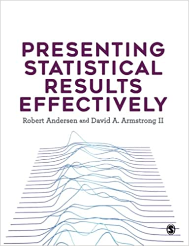

### Books

+ [Presenting Statistical Results Effectively](https://www.amazon.com/Presenting-Statistical-Results-Effectively/dp/1446269817):
Perfect for any statistics student or researcher, this book offers hands-on guidance on how to interpret and discuss your results in a way that not only gives them meaning, but also achieves maximum impact on your target audience. No matter what variables your data involves, it offers a roadmap for analysis and presentation that can be extended to other models and contexts.  Focused on best practices for building statistical models and effectively communicating their results, this book helps you:  
    - Find the right analytic and presentation techniques for your type of data
    - Understand the cognitive processes involved in decoding information
    - Assess distributions and relationships among variables
    - Know when and how to choose tables or graphs
    - Build, compare, and present results for linear and non-linear models
    - Work with univariate, bivariate, and multivariate distributions
    - Communicate the processes involved in and importance of your results.
+ We have developed an [R package](https://github.com/davidaarmstrong/psre) that contains all the data, some helper functions and all the code to replicate the visualizations in the book. You can also download the R code and data from the book's [dataverse](https://dataverse.harvard.edu/dataverse/psre).  

+ [Analyzing Spatial Models of Choice and Judgment with R, 2nd ed:](https://www.routledge.com/Analyzing-Spatial-Models-of-Choice-and-Judgment/Armstrong-Bakker-Carroll-Hare-Poole-Rosenthal/p/book/9781138715332)
With recent advances in computing power and the widespread availability of political choice data, such as legislative roll call and public opinion survey data, the empirical estimation of spatial models has never been easier or more popular. The book demonstrates how to estimate and interpret spatial models using a variety of methods with the popular, open-source programming language R.  The second edition is re-organized so all of the Bayesian content is presented in one chapter in a more coherent way.  We have also improved the R package and moved to `ggplot2` to make all of the plots.   
    - Clone or install the R package `asmcjr` from [github](https://github.com/davidaarmstrong/asmcjr/).  The package includes all of the data for the book in addition to the functions that we wrote to estimate and interrogate the models.  
    - Download all the [R code](/files/r/spatial_2e.r)
    

### Peer Reviewed Articles:

+ "Locating Federalism: Non-Financial Assets and Public Policy in Canada" _Canadian Public Administration_ [Forthcoming] (with Chris Alcantara and Anthony Sayers)

+ ["The Urban-Rural Divide in Canadian Federal Elections, 1896–2019."](https://www.cambridge.org/core/journals/canadian-journal-of-political-science-revue-canadienne-de-science-politique/article/abs/urbanrural-divide-in-canadian-federal-elections-18962019/FDC5CB034B8CC82C83C817026160BA5B)  _Canadian Journal of Political Science_ [Forthcoming] (with Jack Lucas and Zack Taylor)
  
+ ["Policy Ideology and Local Ideological Representation in Canada."](https://www.cambridge.org/core/journals/canadian-journal-of-political-science-revue-canadienne-de-science-politique/article/abs/policy-ideology-and-local-ideological-representation-in-canada/9A6BE10A44A35F87199DDF334DEB36A3)  _Canadian Journal of Political Science_.  [In Press] (with Jack Lucas)
    - [Replication Data](https://dataverse.harvard.edu/dataset.xhtml?persistentId=doi:10.5683/SP2/YDA174)

+ ["Exploring the Effects of Electorate Size on Indigenous Voter Turnout"](https://www.tandfonline.com/doi/full/10.1080/21565503.2021.1926297) _Politics Groups and Identities_ [In Press] (with Chris Alcantara and John Kennedy)

+ ["Do Governments Keep Their Promises? An Analysis of Speeches From the Throne"](https://onlinelibrary.wiley.com/doi/10.1111/gove.12548) _Governance_ [2021] 34(3): 917-934 (with John Kennedy and Chris Alcantara)
    - [Replication Data](https://dataverse.harvard.edu/dataset.xhtml?persistentId=doi:10.7910/DVN/VC7X4J)

+ ["Do COVID-19 Policies Affect Mobility Behaviour? Evidence from 75 Canadian and American Cities"](/files/papers/covid-mobility--version-2-.pdf) _Canadian Public Policy_ [2020] 46(S2): 127-144 (with Matt Lebo and Jack Lucas)

+ ["Measuring and Comparing Municipal Policy Responses to COVID-19"](https://doi.org/10.1017/S000842392000044X) _Canadian Journal of Political Science_ [2020] 53(2): 227-238 (with Jack Lucas) 
    - [Replication Data](https://doi.org/10.5683/SP2/MXWJAZ)

+ ["Casualty Estimates in the Rwandan Genocide"](https://protect-us.mimecast.com/s/LSx3CBB8n5tV9YBmjuzAOzL?domain=tandfonline.com) _Journal of Genocide Research_ [2020] (22)1: 104-111 (with Christian Davenport and Allan Stam). 

+ ["Advisors to Elites: Untangling Their Effects"](https://www.journals.uchicago.edu/doi/10.1086/704740) _Journal of Law and Courts_ [2020] (8)1: 51-73 (with Sara Benesh and Zach Wallander) 
    - [Replication Data](https://doi.org/10.7910/DVN/0VIYXT)

+ ["Getting The Opposition Together: Protest Coordination in Authoritarian Regimes"](https://www.tandfonline.com/doi/full/10.1080/1060586X.2019.1665941) _Post-Soviet Affairs_ [2020] 36(1): 1-19 (with Ora John Reuter and Graeme Robertson)

+ ["The Consequences of Contention: Understanding the Aftereffects of Political Conflict and Violence](https://www.annualreviews.org/doi/abs/10.1146/annurev-polisci-050317-064057) _Annual Review of Political Science_ [2019] 22: 361-377 (with Christian Davenport, Havard Nygard and Hanne Fjelde)

+   ["Using Bayesian Aldrich-McKelvey Scaling to Study Citizens’ Ideological Preferences and Perceptions"](http://onlinelibrary.wiley.com/doi/10.1111/ajps.12151/abstract)
_American Journal of Political Science_  [2015] 59(3): 759-774 (with Christopher Hare, Ryan Bakker, Royce Carroll and Keith Poole) 
    - [Replication Data](https://doi.org/10.7910/DVN/26638) 
    - A [summary blog post ](http://ajps.org/2014/09/18/using-bayesian-aldrich-mckelvey-scaling-to-study-citizens-ideological-preferences-and-perceptions/) is available at the AJPS website  

*   ["Bootstrap Confidence Regions for Multidimensional Scaling Solutions"](http://onlinelibrary.wiley.com/doi/10.1111/ajps.12056/abstract)  
_American Journal of Political Science_ [2014] 58(1): 264-278  (with William G. Jacoby) 
    - [Replication Data](https://doi.org/10.7910/DVN/DPVRA5)
    - Clone from [github](https://github.com/davidaarmstrong/bsmds)

*   ["factorplot: Improving Presentation of Simple Contrasts in GLMs"](/files/papers/factorplot_armstrong.pdf)
_The R Journal_ [2013] 5(2): 4-15.  
    - Clone from [github](https://github.com/davidaarmstrong/factorplot)

*   ["Stability and Change in the Freedom House Political Rights and Civil Liberties"](http://jpr.sagepub.com/content/48/5/653.abstract)  
_Journal of Peace Research_ [2011] 48(5): 653-662.  
    - Online Appendix  **[pdf](/files/papers/FH_measurement_appendix_011011.pdf)**
    - Replication Materials *[zip](/files/papers/jpr_replication.zip)*
    - BibTeX Entry *[bib](/files/papers/jpr2011.bib)*

*   ["Protesting While Black? The Differential Policing of American Activism, 1960 to 1990"](http://asr.sagepub.com/content/76/1/152)  
_American Sociological Review_ [2011] 76(1): 152-176  (with Christian Davenport and Sarah Soule)  
    - Replication Materials *[zip](/files/papers/ASR_replication_101810.zip)*
    - BibTeX Entry *[bib](/files/papers/dsa.bib)*

*   ["The Coalition-Directed Vote in Contexts with Multi-party Governments"](http://journals.cambridge.org/action/displayFulltext?type=1&pdftype=1&fid=7947609&jid=PSR&volumeId=104&issueId=&aid=7947607)  
_American Political Science Review_ [2010] 104(4):698-719  (with Raymond Duch and Jeff May)  
    - Replication Materials *[zip](http://www.raymondduch.com/ideologicalvote)*
    - BibTeX Entry *[bib](/files/papers/apsr_2010.bib)*

*   ["Why Can Voters Anticipate Post-election Coalition Formation Likelihoods"](http://www.sciencedirect.com/science/article/pii/S0261379410000193)  
_Electoral Studies_ [2010] 28: 308-315  (with Raymond Duch)  
    - BibTeX Entry *[bib](/files/papers/coalform.bib)*

*   ["Measuring the Democracy-Repression Nexus"](http://www.sciencedirect.com/science/article/pii/S0261379409000432)  
_Electoral Studies_ [2009] 28: 403-412
    - Data *[stata](/files/papers/drn_data.dta)*
    - BibTeX Entry *[bib](/files/papers/drn.bib)*

*   ["Democracy and the Violation of Human Rights: A Statistical Analysis from 1976-1996"](http://onlinelibrary.wiley.com/doi/10.1111/j.0092-5853.2004.00086.x/pdf)  
_American Journal of Political Science_ [2004] 48(3): 538-554 (with Christian Davenport)  
    - Data *[stata](/files/papers/ajpsdata.dta)*
    - BibTeX Entry *[bib](/files/papers/ajps.bib)*

*   ["Turnout and the Local Age Distribution: Examining Political Participation Across Space and Time"](http://www.sciencedirect.com/science/article/pii/S0962629803001471)  
_Political Geography_ [2004] 23: 71-95 (with Jim Gimpel and Irwin Morris)  
    - BibTeX Entry *[bib](/files/papers/politicalgeog.bib)*

### Published Works (Not Peer Reviewed):

* [Explorations: R Statistics Handbook](https://learninglink.oup.com/access/berdahl4e-student-resources#tag_lab-manual) [2021] New York: Oxford University Press (with Jason Roy and Loleen Berdahl)

*   ["Six Feet Over: Internal War, Battle Deaths and the Influence of the Living on the Dead"](papers/SFOproofs.pdf)  
in _Dilemmas of Insecurity and Violence: Understanding Security in 21st Century Civil Conflicts_  Stephen M. Saideman and Marie-Joelle Zahar, eds. London: Routledge (with Christian Davenport)  
    - BibTeX Entry *[bib](/files/papers/sfo.bib)*

*   ["Understanding Untouchability: A Comprehensive Study of Practices and Conditions in 1589 Villages"](/files/papers/Untouchability.pdf) (with C. Davenport, A.M. Klasing, M. Macwan, M. Pradeep, S. Vania, A. Stam and M.K. Varma)
    - Press Release **[pdf](/files/papers/UntouchabilityRelease.pdf)**

### Works Under Review

### Works in Progress:

#### Statistics and Software

* A Bayesian Analog to the Altnerating Least Squares Optimal Scaling Algorithm (with William Jacoby)

* The Costs and Benefits of Conditioning on Covariates in Models for Measurement

* Machine Learning Tools for Multiple Imputation of Corss-Sectional and Panel/TSCS Data (With Chris Schwarz)

* Machine Learning Tools as Model Diagnostics (with William Jacoby and Chris Schwarz)

* Flexible Control Variable Modeling using Machine Learning Tools (with Tyler Girard)

* Missing Data and the Gibbs Sampler: A Simple Approach to Estimating Models With Missing Data (with Ryan Bakker and Johannes Karreth)

#### Democracy and Repression

* The Unexpected Effect of Elections on Repression

* Causal Mechanisms and the Democracy-Repression Nexus

#### Other

* New Models for Manifesto-Based Left-Right Placements (with Ryan Bakker and Jon Polk)
Previous version: ["Take That you Lousy Dimension"](http://www.quantoid.net/takethatfinal.pdf) (with Ryan Bakker)

